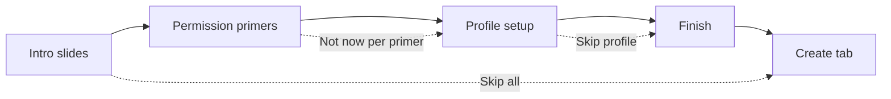

# Onboarding — Requirements

## Doc metadata

- Feature: First-run onboarding (intro + **profile setup**)
- Doc owner: Nick
- Created: 2026-06-02
- Last updated: 2026-06-03
- Status: **Design handoff received** — Claude Design prototype in `docs/design-system/design_handoff_onboarding/`; Phase 2 = implement in RN
- Routes: `/onboarding` (today); likely `/onboarding` stack with substeps after redesign
- Related: `docs/requirements/PRODUCT_DESIGN_REQUIREMENTS.md`, `docs/release/app-store-v1-launch-scope.md`
- Adopted UX decisions: [`ONBOARDING_RECOMMENDATIONS.md`](./ONBOARDING_RECOMMENDATIONS.md)
- Design system (light, doc-first): [`../design-system/README.md`](../design-system/README.md)
- Implementation notes: [`../design-assets/onboarding-workflow/`](../design-assets/onboarding-workflow/)
- **Design handoff (Claude Design):** [`../design-system/design_handoff_onboarding/README.md`](../design-system/design_handoff_onboarding/README.md)
- Implementation today: `app/onboarding.tsx` (carousel only), `app/(tabs)/profile.tsx` (full profile editor)
- Profile persistence: `convex/users.updateProfile`, `src/lib/localProfile.ts` (guest)

---

## 1. Summary

After sign-in or guest entry, users see a **short intro**, then **set up their artist profile** before entering the app. Profile setup is not a passive slide — they enter name, photo, and optionally other fields so the **shareable profile card** (Profile tab) is meaningful on day one.

**North-star:** User finishes onboarding with a **named, recognizable profile** and understands the Music Promo loop (photo + audio → export → share).

**v1 scope:** Music Promo + Profile only. No SPK, Show Flyer, or discovery.

---

## 2. Goals (v1 polish)

- **Intro** — 1–2 fast story slides (value + flow), skippable as a block or per global Skip.
- **Profile setup** — Required step in the funnel; user actually creates profile data, not just reads about it.
- **Pre-fill** — Use Clerk name/avatar when signed in; sensible guest defaults.
- **Preview** — Show how their card will look (mini share-card preview updates as they edit).
- **Premium feel** — Light theme, press scale, no cheap full-screen spinners on form body.
- **Permission priming** — Dedicated in-app screens **before** iOS/Android system permission dialogs (photos, save to library, audio files). No surprise popups mid-tap.
- **Forgiving** — User can skip profile step or individual optional fields without blocking the app forever.

## 3. Non-goals

- Full Profile tab parity in onboarding (no account delete, push settings, project grid).
- SPK / Flyer / Search / public profiles.
- Mandatory hero banner, bio, or all social links in v1 (hero + bio are **optional** fields on profile step; links deferred).
- Push notification permission priming in v1 onboarding (can stay on Profile / first use).
- Microphone / camera capture (v1 uses library + document picker only).
- Lottie / video backgrounds in v1 (optional in design).
- Re-onboarding everyone unless `CURRENT_ONBOARDING_VERSION` is bumped.

---

## 4. Flow architecture

Onboarding is a **linear wizard**. Implement as separate steps; use one route with step state or a small stack.



| Phase | Step IDs | Type | Purpose |
|-------|----------|------|---------|
| **A — Intro** | `value`, `flow` | Story (paged carousel) | Why + how Music Promo works |
| **P — Permissions** | `perm-photos`, `perm-audio` | **Priming screens** in wizard; `perm-save` deferred to first export (see recommendations doc) |
| **B — Profile** | `profile-setup` | **Interactive form** | User builds artist profile |
| **C — Finish** | `ready` | Story (single screen) | Confirm + CTA into app |

**Removed from v1 story:** passive `profile` marketing-only slide (replaced by `profile-setup`).

### 4.0 Permission priming (your request) — **makes sense**

**Problem today:** Tapping “Pick photo” or avatar opens the **system** permission sheet immediately (`ImagePicker.requestMediaLibraryPermissionsAsync` in `picker.tsx` / `profile.tsx`). That feels abrupt mid-task.

**Pattern:** Our screen (copy + illustration) → user taps **Continue** → **then** we call the OS permission API or open the picker. Apple calls this a “pre-permission” or priming screen; it improves acceptance and trust.

**Hard rule for implementation:** Do not call `requestMediaLibraryPermissionsAsync`, `MediaLibrary.requestPermissionsAsync`, or launch pickers that trigger permissions until the user has seen the matching primer and tapped **Continue** (or already granted / primer completed in a past session).

### 4.1 When onboarding appears

Same as today: first sign-in or guest, until local version / Convex `onboardingCompletedAt` is set. Mid-flow kill → resume at last incomplete step (eng stores `onboardingStep` locally — see §11).

### 4.2 Exit paths

| Action | Analytics | Lands on |
|--------|-----------|----------|
| **Start Creating** (after finish step) | `onboarding_completed` `method: cta` | **Create tab** with picker visible (+ optional first-run hint on picker) |
| **Skip** (header, any step) | `onboarding_completed` `method: skip` | Home or Create (pick one; document in design) |
| **Skip profile** (secondary on profile step only) | `onboarding_profile_skipped` + completion | Finish step or directly complete |

---

## 5. Phase A — Intro slides (story)

Design **1–2 story slides** (recommend **2**). Copy is draft — finalize in `copy.md` or in code.

| Slide ID | User question | Title (draft) | Body (draft) | Visual |
|----------|---------------|---------------|--------------|--------|
| `value` | Why use this? | Turn a photo and a track into a promo in seconds | Pick cover art, add audio, export a social-ready clip — no timeline editor. | Photo + audio → video metaphor |
| `flow` | What’s the loop? | Pick, trim, export, share | Four steps, under a minute. Built for releases, not editing courses. | Chips: **Pick → Trim → Export → Share** |

**CTA on intro:** `Next` → advances to **permission primers** (not profile yet). Last intro slide: `Next`.

---

## 5b. Phase P — Permission priming screens

Design **one full screen per access type** (three in v1). Same chrome as onboarding: step counter, optional global Skip, primary **Continue**, secondary **Not now**.

### P.1 Screen catalog

| Step ID | When we need it | Title (draft) | Body (draft) | Tap **Continue** triggers | If **Not now** |
|---------|-----------------|---------------|--------------|---------------------------|----------------|
| `perm-photos` | Pick **photos** (profile banner + avatar, promo cover, template background) | Allow access to your photos | MusicPromo needs your photo library for profile banner and cover art. We only access files you choose. | `ImagePicker.requestMediaLibraryPermissionsAsync()` — system dialog | Advance; show this primer again on first photo action until acknowledged or granted |
| `perm-save` | **Save exported videos** to camera roll | *(not in onboarding wizard)* | Same copy as draft in recommendations | `MediaLibrary.requestPermissionsAsync()` on **first Share save** only | N/A in wizard |
| `perm-audio` | Pick **audio files** for promos | Access your audio files | Choose MP3, WAV, or M4A from your device. You stay in control — we only use the file you select. | **No OS dialog on iOS** — mark primer complete; first pick uses `DocumentPicker` | Advance; show primer again before first audio pick in Create |

**Note:** iOS uses separate Info.plist strings for read vs add — see `app.json` (`photosPermission`, `savePhotosPermission`). Primers should use plain language; system dialog text stays native.

### P.2 Layout (each primer)

```
┌─────────────────────────────────────┐
│  [step counter]          [Skip]     │
├─────────────────────────────────────┤
│         [ illustration ]            │
│                                     │
│   Title — what we're asking         │
│   Body — why, for Music Promo       │
│   Bullet: you choose the files      │
│                                     │
├─────────────────────────────────────┤
│        [ Not now ]    (text)        │
│        [ Continue ]   (primary)     │
└─────────────────────────────────────┘
```

- **Continue** = “I understand — show the system prompt” (or proceed for audio).
- **Not now** = skip this primer for now; do not call system API on this screen.
- If permission already **granted**, skip primer automatically (or show brief “Already enabled” + Continue).

### P.3 Suggested order in wizard

Place **after intro, before profile setup** so avatar pick never hits a cold system dialog:

1. `value` → 2. `flow` → 3. `perm-photos` → 4. `perm-audio` → 5. `profile-setup` → 6. `ready`  
(`perm-save` only on first export — see [`ONBOARDING_RECOMMENDATIONS.md`](./ONBOARDING_RECOMMENDATIONS.md) §1)

Profile avatar tap after step 3 should go straight to library if user tapped Continue on `perm-photos`.

### P.4 After onboarding (Create / Share)

If user chose **Not now** on a primer, show the **same primer screen** (modal or pushed step) the first time that capability is needed:

| Trigger | Primer to show |
|---------|----------------|
| First “Select Photo” on Create picker | `perm-photos` |
| First “Pick audio” on Create picker | `perm-audio` |
| First save to camera roll on Share | `perm-save` |
| Avatar change on Profile (if never granted) | `perm-photos` |

Reuse one component; only the entry point differs.

### P.5 Denied permission

After system dialog returns **denied**:

- Do not re-show system dialog on every tap.
- Show inline card: “Photos access is off” + **Open Settings** (existing pattern in picker).
- Primer can be shown again from Settings path only if user resets permissions.

### P.6 States to design (each primer)

| State | Notes |
|-------|--------|
| Default | Illustration + copy |
| Continue pressed | Brief loading while awaiting system sheet |
| Granted | Optional success checkmark → auto-advance |
| Denied | Inline message + Open Settings; **Not now** still advances wizard |
| Already granted | Skip or single-line “You’re all set” |

---

## 6. Phase B — Profile setup (interactive) — **core new requirement**

### 6.1 User story

> As a new artist, I want to add my name and photo (and optionally links) during onboarding so my profile card is ready when I share my first promo.

### 6.2 Fields

| Field | Required? | Max / rules | Pre-fill source |
|-------|-----------|-------------|-----------------|
| **Artist name** | **Yes** to continue via primary CTA | 50 chars | Clerk `fullName` or guest empty |
| **Avatar** | No (encouraged) | Library picker; persist like Profile | Clerk `imageUrl` if signed in |
| **Hero / banner** | No (encouraged) | Library picker; wide banner behind/overlapping avatar — same pattern as Profile tab | Default brand banner (`MusicPromo-Banner.png`) until user picks one |
| **Bio** | **No** (optional field) | 280 chars; collapsed or secondary field — see recommendations doc | Empty |
| **Links** | No | Profile tab only in v1 | Empty |

**Primary CTA enable rule:** Artist name trimmed length ≥ 1.

**Secondary action:** `Skip for now` — saves nothing new (or saves pre-fill only) and advances to finish step; profile remains editable later on Profile tab.

### 6.3 UI regions to design

```
┌─────────────────────────────────────┐
│  [step counter]          [Skip]     │
├─────────────────────────────────────┤
│  Title: Set up your artist profile  │
│  Subtitle: Used on your share card  │
│  (guests: sign in later to sync)    │
│                                     │
│  ┌─────────────────────────────┐   │
│  │  Hero banner — tap to edit   │   │  ← Default brand image until picked
│  └─────────────────────────────┘   │
│       ( Avatar — circle, + )        │  ← Overlaps banner (Profile-style)
│                                     │
│  [ Artist name — TextField ]        │
│  [ Bio (optional) — 280 chars ]     │
│                                     │
│  ┌─────────────────────────────┐   │
│  │  Live share-card preview     │   │  ← Banner + avatar + name + bio
│  └─────────────────────────────┘   │
├─────────────────────────────────────┤
│      [ Skip for now ]  (text)       │
│      [ Continue ]      (primary)    │
└─────────────────────────────────────┘
```

**Layout note:** Match Profile tab hero + overlapping avatar so onboarding previews the real profile shell.

### 6.4 Live preview

- Reuse visual language from Profile **share card** (`ViewShot` card on Profile tab).
- Updates as name, avatar, banner, and bio change (debounced OK in implementation).
- Empty avatar → default avatar asset (`assets/defaults/MusicPromo-DefaultAvatar.jpg`).
- Empty banner → default brand banner (`assets/branding/MusicPromo-Banner.png`), same as Profile.
- Promos on card preview: empty state copy — e.g. “Your promos will show here” (no projects yet).

### 6.5 Persistence on Continue

| Session | Storage |
|---------|---------|
| Signed-in | `users.updateProfile` — `artistName`, `avatarImageUrl`, optional `heroImageUrl`, `bio`, `links` |
| Guest | `setLocalArtistProfile` in AsyncStorage |

Then advance to **finish** step (do not complete onboarding until finish CTA unless product decides profile alone completes — **recommended:** finish step still shown).

### 6.6 Permissions & errors

- Avatar and hero taps → `launchImageLibraryAsync` only (photos primed on `perm-photos`). If denied, inline message + Open Settings — **no** system sheet on tap.
- Save failure → inline error + retry; do not block leaving via Skip.
- Offline signed-in → write local profile fallback if needed (match Profile tab behavior).

### 6.7 States to design (profile step)

| State | Notes |
|-------|--------|
| Default | Pre-filled name from Clerk |
| Empty name | Primary CTA disabled |
| Picking avatar / banner | Loading on respective control |
| Permission denied | Inline under hero or avatar tap target |
| Default banner only | Brand placeholder visible; preview still valid |
| Saving | CTA shows spinner |
| Preview empty promos | Placeholder in card mock |

---

## 7. Phase C — Finish slide

| Slide ID | Title (draft) | Body (draft) | CTA |
|----------|---------------|--------------|-----|
| `ready` | You’re set | Your profile is ready. Create your first promo whenever you want. | **Start Creating** |

Completing this step runs existing completion persistence + `onboarding_completed`.

---

## 8. Screen structure (whole wizard)

**Step counter** reflects **total steps** (e.g. `6/6` with adopted primer set). **Top progress bar** across wizard (see recommendations doc §6).

| Step index | ID | Footer primary label |
|------------|-----|----------------------|
| 1 | `value` | Next |
| 2 | `flow` | Next |
| 3 | `perm-photos` | Continue |
| 4 | `perm-audio` | Continue |
| 5 | `profile-setup` | Continue |
| 6 | `ready` | Start Creating |

**Paging:** Horizontal swipe only on **story** steps (`value`, `flow`, `ready`). Primers + profile are single-screen. Profile step **vertical scroll** when keyboard is open.

**Theme:** **Light only** (v1) — all onboarding steps use `colors.light.*`; see [`DESIGN_SYSTEM.md`](../design-system/DESIGN_SYSTEM.md).

---

## 9. Implementation checklist

Build in React Native per [`DESIGN_SYSTEM.md`](../design-system/DESIGN_SYSTEM.md) and [`COMPONENTS.md`](../design-system/COMPONENTS.md):

1. **Six steps** — story slides, permission primers (§5b.6), profile-setup (§6.7), finish, loading gate.
2. **Permission primer** copy per `perm-*` ID; optional illustrations in `assets/onboarding/`.
3. **Profile-setup** — hero + avatar overlap, name, optional bio, share-card preview.
4. Final **copy** in `docs/design-assets/onboarding-workflow/copy.md` or inline constants.
5. **Bio (optional)** — see [`ONBOARDING_RECOMMENDATIONS.md`](./ONBOARDING_RECOMMENDATIONS.md).
6. **Skip / Not now** on primers (defer vs block).
7. **Light theme only** — `colors.light.*` tokens.

---

## 10. Premium feel (onboarding)

- [ ] Continue / Start Creating / Next use **scale press** (`pressScaleStyle`).
- [ ] Profile step: no full-screen spinner over form (inline only).
- [ ] Keyboard: name field stays visible; consider `react-native-keyboard-controller` in v1.1 — verify with keyboard open in simulator.
- [ ] Share-card preview feels **real**, not a static screenshot.

---

## 11. Analytics & persistence

| Event | Properties | When |
|-------|------------|------|
| `onboarding_profile_started` | — | Profile step entered |
| `onboarding_profile_completed` | `has_avatar`, `has_hero`, `has_bio` | Continue succeeds |
| `onboarding_profile_skipped` | — | Skip for now on profile |
| `permission_primer_viewed` | `primer_id`: `perm-photos` \| `perm-save` \| `perm-audio` | Primer mounted |
| `permission_primer_continue` | `primer_id`, `system_result`?: `granted` \| `denied` \| `n/a` | Continue tapped |
| `permission_primer_deferred` | `primer_id` | Not now tapped |
| `onboarding_completed` | `method`: `cta` \| `skip`, `profile_completed`: bool | Wizard done |

**Persistence (eng):**

- `CURRENT_ONBOARDING_VERSION` → bump to **3** when this ships (re-show onboarding once).
- **Required** local `onboardingStep` key to resume wizard mid-flow (see recommendations doc §5).
- Local flags per primer: e.g. `musicpromo:primer:perm-photos:ack` (completed or deferred).
- Convex `onboardingCompletedAt` unchanged.

---

## 12. Open decisions

| # | Question | Options | Recommendation |
|---|----------|---------|----------------|
| 1 | Post-onboarding landing | Home vs **Create** | **Create** — user is warmed up to make a promo |
| 2 | Bio in onboarding | Required vs omit vs optional | **Optional field** — name required; bio + links not required (links deferred) |
| 3 | Global Skip on profile step | Skip entire onboarding vs jump to finish | **Skip entire** = today’s behavior; add **Skip for now** only on profile |
| 4 | Complete without finish slide | Profile Continue → app | Keep **finish** slide for closure + analytics clarity |
| 5 | Guest profile | Same form | Yes — local storage only |
| 6 | Hero banner in onboarding | Hide vs include | **Include** — hero + avatar on profile step (optional to customize, default brand banner) |
| 7 | `perm-save` in wizard | In onboarding vs first export | **First export only** (adopted rec #1) |
| 8 | Primer placement | Onboarding only vs + Create fallback | **Both** — onboarding sequence + first-use fallback (§5b.4) |

---

## 13. Implementation notes (for eng, post-design)

- Shared `PermissionPrimerScreen` component + `usePermissionGate(primerId)` hook.
- Centralize permission requests in one module (e.g. `src/lib/permissions.ts`); remove direct `requestMediaLibraryPermissionsAsync` from picker/profile avatar paths.
- Extract or share profile save/pick logic from `profile.tsx` (avoid duplicating picker + `updateProfile` / `setLocalArtistProfile`).
- Consider `app/onboarding/_layout.tsx` + steps: `intro`, `perm-*.tsx`, `profile-setup`, `finish`.
- Reuse share-card layout component for preview (factor out of Profile if needed).
- Bump `CURRENT_ONBOARDING_VERSION` to `3`.
- Pre-fill: `useUser()` from Clerk on profile step mount.
- Refactor `app/create/picker.tsx` and `app/create/share.tsx` to use permission gate before requesting access.

---

## 14. Acceptance criteria

- [ ] New user sees intro → **permission primers** → profile setup → finish → app.
- [ ] System photo/save dialogs never appear without a prior primer + Continue (except already-granted).
- [ ] **Not now** defers primer; first Create/Share use shows primer again.
- [ ] Continue disabled until artist name is non-empty.
- [ ] Avatar, hero (if picked), name, and bio persist to Convex (signed-in) or local guest profile.
- [ ] Share-card preview updates with name/avatar.
- [ ] Skip for now and global Skip both land in app without trapping user.
- [ ] `onboarding_profile_*` and `onboarding_completed` events fire correctly.
- [ ] Copy does not mention SPK / Flyer.
- [ ] Relaunch after complete does not show onboarding again (until version bump).

---

## 15. References

- Carousel implementation: `app/onboarding.tsx`
- Profile editor + share card: `app/(tabs)/profile.tsx`
- Local profile: `src/lib/localProfile.ts`
- Convex: `convex/users.ts` (`updateProfile`, `completeOnboarding`)
- Tokens: `src/constants/tokens.ts`
- Adopted recommendations: [`ONBOARDING_RECOMMENDATIONS.md`](./ONBOARDING_RECOMMENDATIONS.md)
